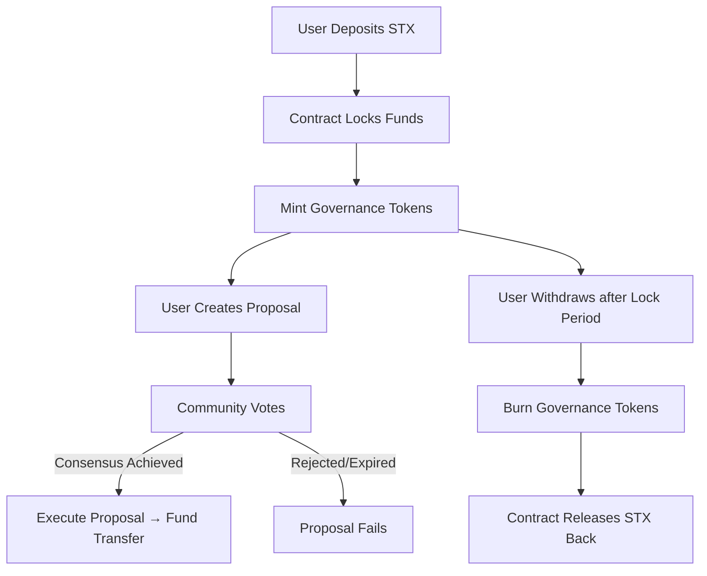

# BitFlow Treasury

**A Bitcoin-Native Decentralized Fund Management Protocol**

---

## Overview

**BitFlow Treasury** is a decentralized, non-custodial treasury management protocol built on **Stacks Layer 2**, secured by Bitcoin. It enables communities, DAOs, and investment collectives to manage shared funds in a transparent, programmable, and trustless environment.

By leveraging **Clarity smart contracts**, the protocol enforces governance rules on-chain — ensuring that **fund allocation, withdrawals, and treasury operations are always subject to community consensus**.

---

## Key Features

* **Non-Custodial Asset Management** — Users retain sovereignty over their deposits.
* **Democratic Governance** — Token-weighted voting for proportional influence.
* **Time-Lock Security** — Configurable withdrawal delays mitigate hostile takeovers.
* **Proposal-Driven Operations** — All fund disbursements require governance approval.
* **Bitcoin Settlement Guarantees** — Anchored by Bitcoin via Stacks’ Proof-of-Transfer consensus.
* **Audit-Ready Transparency** — All actions, votes, and proposals remain verifiable on-chain.

---

## System Overview

The protocol centers on **community-governed proposals** that determine fund allocation. Depositors receive governance tokens proportional to their contributions, which grant them the ability to vote on proposals. Execution of proposals occurs only when quorum and voting thresholds are met.

**Flow of Funds & Governance:**

1. **Deposit** → Users lock STX into the contract.
2. **Mint** → Governance tokens are minted for voting rights.
3. **Propose** → Any token holder can create proposals for fund usage.
4. **Vote** → Participants vote YES/NO, weighted by their governance tokens.
5. **Execute** → Successful proposals transfer funds after expiration & consensus.
6. **Withdraw** → Users reclaim deposits after lock periods.

---

## Contract Architecture

The protocol is composed of core **Clarity modules and state maps** that enforce governance logic.

### Core Components

* **Balances Map** → Tracks governance token balances per user.
* **Deposits Map** → Records user deposits, lock periods, and eligibility for withdrawal.
* **Proposals Map** → Stores metadata of proposals (proposer, target, amount, expiry, vote counts).
* **Votes Map** → Tracks voter participation to prevent double voting.

### Key Public Functions

* `initialize` → One-time setup by contract owner.
* `deposit` → Lock STX into treasury and mint governance tokens.
* `withdraw` → Burn tokens and unlock STX after lock period.
* `create-proposal` → Submit a new proposal with amount, target, and duration.
* `vote` → Cast a weighted vote (YES/NO) on an active proposal.
* `execute-proposal` → Finalize proposal and disburse funds if consensus is met.

### Governance Safeguards

* **Minimum & Maximum Duration** → Prevents spam and rushed governance.
* **Proposal Expiration** → Expired proposals cannot be executed.
* **Voting Thresholds** → Only majority-approved proposals move forward.
* **Withdrawal Locks** → Time-delays reduce manipulation during critical votes.

---

## Data Flow



---

## Security Model

* **Multi-Layer Protection**

  * Time-delayed withdrawals.
  * Proposal expiration and validation checks.
  * Strict voting power tied to balances.
* **No Single Point of Failure** — All actions require community approval.
* **On-Chain Transparency** — Every decision and fund movement is immutable and auditable.

---

## Use Cases

* **DAO Treasury Management** → Collective fund governance for Bitcoin-focused DAOs.
* **Community Investment Pools** → Transparent investment strategies driven by proposals.
* **Grant Distribution** → Fair allocation of grants through consensus-based voting.
* **Venture Funds** → Decentralized collective investment vehicles.
* **Multi-Stakeholder Project Funding** → Trustless financing for open-source or public goods.

---

## Technical Stack

* **Language:** [Clarity Smart Contracts](https://docs.stacks.co/docs/write-smart-contracts/clarity-overview)
* **Network:** [Stacks Layer 2](https://stacks.co) (settled on Bitcoin)
* **Consensus Security:** Proof-of-Transfer (PoX) anchoring on Bitcoin

---

## Getting Started

### Requirements

* Stacks CLI or Clarinet for contract testing.
* STX tokens for contract interaction.

### Deployment (using Clarinet)

```bash
clarinet integrate
clarinet test
clarinet deploy
```

### Interacting

* `deposit u1000000` → Deposit 1 STX.
* `create-proposal "Fund community project" u5000000 <target-principal> u1440` → Proposal to send 5 STX.
* `vote <proposal-id> true` → Cast a YES vote.
* `execute-proposal <proposal-id>` → Execute after expiry if passed.

---

## License

MIT License © 2025 BitFlow Treasury Contributors
